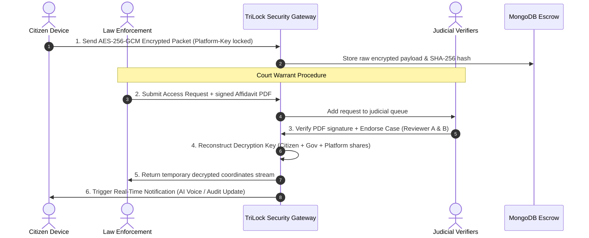


# 🔐 TriLock — Enterprise Privacy-Preserving Surveillance Framework

[](#)
[](#)
[](#)
[](#)

> **Live Production Deployments:**  
> 💻 **Frontend Web App:** [https://tri-lock.vercel.app](https://tri-lock.vercel.app)  
> ⚙️ **Backend REST API:** [https://trilock-api.onrender.com](https://trilock-api.onrender.com)  
> 🩺 **Service Health Status:** [https://trilock-api.onrender.com/api/health](https://trilock-api.onrender.com/api/health)

TriLock is a zero-trust, enterprise-grade privacy-preserving surveillance framework designed to balance municipal public safety requirements with constitutional citizen privacy rights. The platform leverages advanced cryptography, multi-party threshold authorization, and immutable logging to prevent unauthorized telemetry access.

### 🌟 Key Features
* **Triple-Key Threshold Cryptography:** Decryption requires Citizen + Government + Platform key shares.
* **Tamper-Evident Merkle-Style Ledger:** Every transaction is hash-chained to prevent retroactive edits.
* **AI-Powered Voice Dispatch Alerts:** Integrates with OmniDimension to place real-time outbound AI voice calls to citizens the instant their telemetry is accessed under judicial warrants.
* **Isolated Multi-Role Clearance Portals:** Clean RBAC partitioning for Citizens, Officers, Judicial Verifiers, and Admins.

---

## 🎯 System Philosophy

Traditional data surveillance systems represent a structural compromise: either sacrifice public safety by restricting access, or compromise civil liberties with unchecked monitoring. **TriLock** resolves this through cryptographic separation of authority.

By utilizing **Shamir's secret sharing threshold scheme**, **dual-verifier digital signatures**, and a **tamper-evident cryptographic ledger**, TriLock guarantees that citizen telemetry remains fully sealed at rest and in transit. Access is only reconstructed dynamically under legally authorized, multi-party verified conditions.

---

## 🏗️ Architectural Flow

The diagram below illustrates how raw location data is encrypted at the source and remains locked until court warrants undergo a dual-signature judicial clearance process, reconstructing the keys in-memory.



---

## 🔐 Cryptographic Pillars

### 1. Triple-Key Threshold Cryptography
Telemetry is encrypted at rest using `AES-256-GCM`. The master decryption key is never stored. Instead, it is derived dynamically when three separate cryptographic key shares converge:
* **Citizen Device Key Share:** Stored on the user's client device; supports rotatable key epochs.
* **Law Enforcement Key Share:** Managed by the security gateway.
* **Neutral Platform Key Share:** Kept in escrow by the core platform infrastructure.

> [!IMPORTANT]
> Decryption is impossible unless all three distinct key shares are dynamically assembled in memory. No single party can decrypt or access location history unilaterally.

### 2. Hash-Chained Audit Ledger
Every transaction (user registration, authentication, key rotation, warrant application, review, and data access) is written to a sequential, append-only security ledger.
* Every block references the SHA-256 hash of the preceding block.
* Any unauthorized modification breaks the hash chain validation immediately.
* Admins can run verification checks to validate ledger continuity.

### 3. Absolute Citizen Transparency
Whenever a warrant is authorized and data is accessed, a background notification pipeline notifies the citizen via real-time triggers (with support for integrated **OmniDimension AI voice alerts**). Citizens have a dedicated dashboard displaying the complete audit history of who requested their data, when it was decrypted, and the judicial cause.

---

## 🏗️ System Components & Portals

The project is structured with a modular API service and a modern Next.js dashboard UI.

```
cyberhackathon/
├── client/          # Next.js 16 (App Router + TypeScript + Tailwind CSS)
└── server/          # ExpressJS REST API (NodeJS + Mongoose + MongoDB)
```

### Isolated Role Portals

| Portal | Scope & Capabilities | Security Clearance |
| :--- | :--- | :---: |
| **Citizen View** | Monitor vault status, execute device key rotation, inspect audit trails. | User Level |
| **Law Enforcement** | File warrant requests, upload signed PDFs, invoke emergency keys. | Officer Level |
| **Verification Authority** | Independent judicial warrant verification queue & dual-signature checklist. | Verifier Level |
| **System Administration** | Health metrics, user directory oversight, audit ledger validation. | System Administrator |

---

## 🛡️ Security Audit & Hardening
The codebase has undergone a rigorous security review and implements protection against:
* **NoSQL Injection:** Parameter sanitization on regex queries inside administrative utilities.
* **DoS Attacks:** Express rate limiters on authentication routes (20 requests per 15 mins) and strict pagination caps.
* **Data Leakage:** Removal of raw developer error stack traces from production payloads.
* **JWT Exposure:** Caching restrictions and referrer shields applied to file preview links during warrant document downloads.

---

## 📡 API Endpoints

### Authentication & Profiles
* `POST /api/auth/register` — Self-register a new citizen user (generates device keys & vault).
* `POST /api/auth/login` — Authenticate and receive a JWT session token.
* `GET /api/auth/me` — Retrieve active profile details.

### Cryptographic Keys
* `GET /api/keys/status` — Inspect rotation intervals, key status, and active key versions.
* `GET /api/keys/totp` — Fetch rotating 6-digit Zero-Knowledge token (regenerates every 30s).
* `POST /api/keys/regenerate` — Perform an epoch shift (rotate citizen key).
* `GET /api/keys/citizen-key/:requestId` — Securely retrieve citizen share for approved warrants.
* `POST /api/keys/triple-access` — Reconstruct threshold key and decrypt citizen location packets.

### Telemetry & Vault
* `GET /api/vault` — Fetch encryption standard and vault storage metrics.
* `GET /api/vault/packets` — Retrieve encrypted telemetry metadata (paged).
* `GET /api/vault/integrity` — Recompute and audit SHA-256 hashes of all stored packets.
* `POST /api/packets/collect` — Send, encrypt, and store location coordinates.

### Warrants & Audits
* `POST /api/requests` — Lodge a formal surveillance case request.
* `GET /api/requests` — List active requests (filtered by RBAC clearance).
* `POST /api/reviews` — Log judicial check verification and case endorsement.
* `POST /api/upload/court-order` — Upload PDF/image affidavits (hashes files for integrity).
* `GET /api/audit/verify` — Check blockchain-like hash integrity of the system audit chain.

---

## 🎭 Demo Credentials

Use these pre-seeded development accounts to test the system:

| Role Portal | Credentials | Password |
| :--- | :--- | :--- |
| **Citizen (User)** | `citizen@trilock.demo` | `citizen123` |
| **Citizen 2 (User)** | `citizen2@trilock.demo` | `citizen123` |
| **Government Officer** | `officer@trilock.demo` | `officer123` |
| **Judicial Reviewer A** | `reviewer1@trilock.demo` | `reviewer123` |
| **Judicial Reviewer B** | `reviewer2@trilock.demo` | `reviewer123` |
| **Platform Admin** | `admin@trilock.demo` | `admin123` |

---

## 🔄 End-to-End Demo Walkthrough

Try this testing flow to see the framework in action:
1. **Login as Citizen** (`citizen@trilock.demo`) -> Click **Capture & Encrypt Packet** to simulate location tracking. Go to **Data Vault** to view the encrypted, hashed records.
2. **Login as Government Officer** (`officer@trilock.demo`) -> Click **New Warrant Request** -> Enter the citizen's email and legal justification -> **Upload any PDF/Image** as the signed court affidavit.
3. **Login as Reviewer A** (`reviewer1@trilock.demo`) -> Click the case docket -> Complete the constitutional checklist -> Click **Endorse**.
4. **Login as Reviewer B** (`reviewer2@trilock.demo`) -> Locate the same case docket -> Click **Endorse** (Dual-reviewer verification complete).
5. **Login as Government Officer** (`officer@trilock.demo`) -> Open the **Emergency Break-Glass** gateway -> Generate an ephemeral access token -> Click **Decrypt Stream** to view the decrypted location coordinates.
6. **Login as Citizen** (`citizen@trilock.demo`) -> Go to the **Audit Trail** to see the chronological record of the search warrant and data decryption.

---

## ⚙️ Local Installation & Setup

### Prerequisites
* **Node.js** v18 or later
* **npm** v9 or later
* **MongoDB** v6.x running locally on `localhost:27017`

### Step 1: Environment Variables
Create a `.env` file in the root of the project with:
```env
PORT=5000
MONGODB_URI=mongodb://localhost:27017/trilock
JWT_SECRET=your_jwt_secret_key
PLATFORM_ENCRYPTION_KEY=your_64_character_hex_string
TOTP_SECRET=your_totp_secret_string
UPLOAD_DIR=./uploads
```

### Step 2: Initialize the Backend
```bash
cd server
npm install
npm run seed     # Seeds all demo accounts and initial telemetry
npm run dev      # Starts on http://localhost:5000
```
*(Alternatively, run `npm run dev:mem` to run a fully automated in-memory MongoDB database.)*

### Step 3: Initialize the Frontend
```bash
cd client
npm install
npm run dev      # Starts Next.js app on http://localhost:3000
```

---

*Designed and engineered with a focus on modern security standards, zero-trust architectures, and data privacy rights.*
